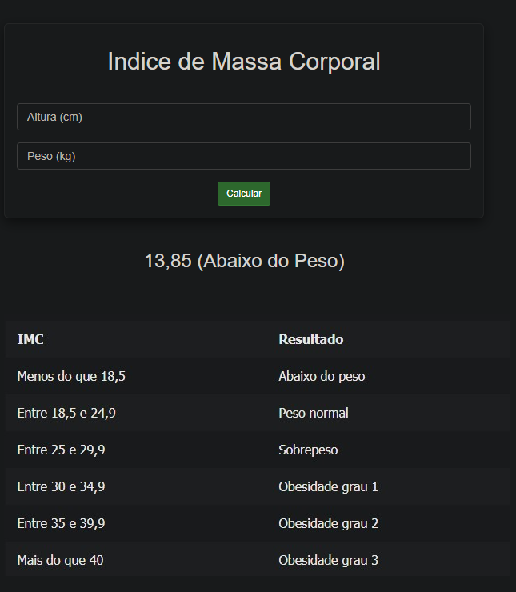

# IMC

Projeto que resolve o exercício "Cálculo de IMC com Página Dinâmica" através de uma página que calcula o índice de massa corporal. Mais informações sobre o índice [clicando aqui](https://www.minhavida.com.br/alimentacao/tudo-sobre/32159-imc).



## Requisitos
- Maven (MVN ou MVNW)

## Comandos úteis
```sh
mvn -N io.takari:maven:0.7.6:wrapper -Dmaven=3.6.1
mvnw org.apache.tomcat.maven:tomcat7-maven-plugin:run -Dmaven.tomcat.port=9090
http://localhost:9090/imc-pagina-dinamica
```
